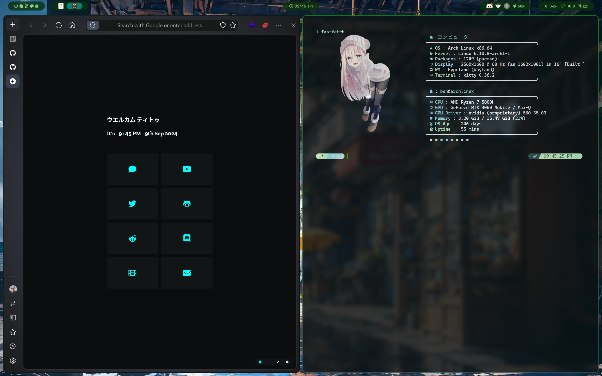
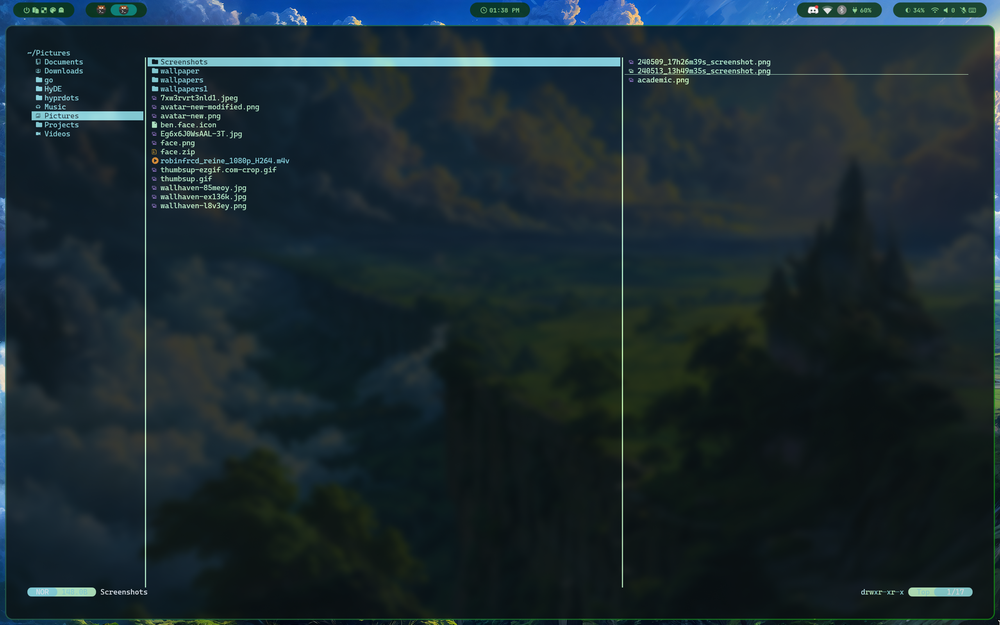
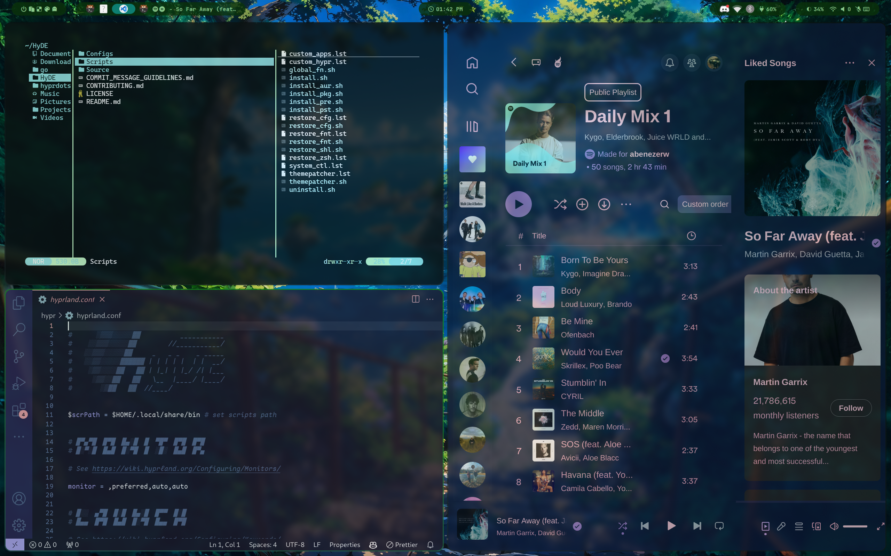

<div align = center><br><br></div>


> [!IMPORTANT]
> This is not a standalone theme, needs [Hyprdots](https://github.com/prasanthrangan/hyprdots) installed...
> 






> [!NOTE]
> WORK IN PROGRESS...

## Installation
```sh
Hyde theme patch "Green Lush" https://github.com/abenezerw/Green-Lush
```
or 
```sh
Hyde theme patch
```
and choose Green Lush

---

or install another theme from [HyDe Gallery](https://github.com/kRHYME7/hyde-gallery)
